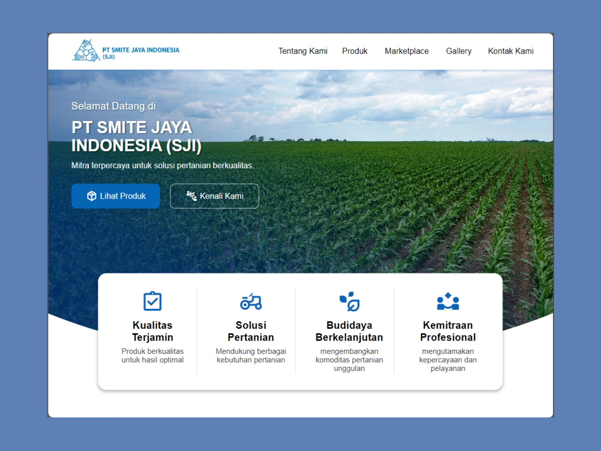

## PT Smite Jaya Indonesia - Corporate Website

Developed and deployed a modern, responsive agricultural corporate website designed to establish and strengthen PT Smite Jaya Indonesia's digital presence and agribusiness operations.

## Preview

## Features

- Responsive design for desktop, tablet, and mobile devices.
- Sections for About Us, Products, Marketplace, Gallery, and Contact Us.
- Displays several product cards offered by the company and links to its marketplace (Shopee).
- Link to the company's marketplace (Shopee).
- Gallery overlay feature.

## Technologies

  

## Live Demo
[View Live Demo](https://ahmadmubarak1112.github.io/pt-smite-jaya-indonesia/)